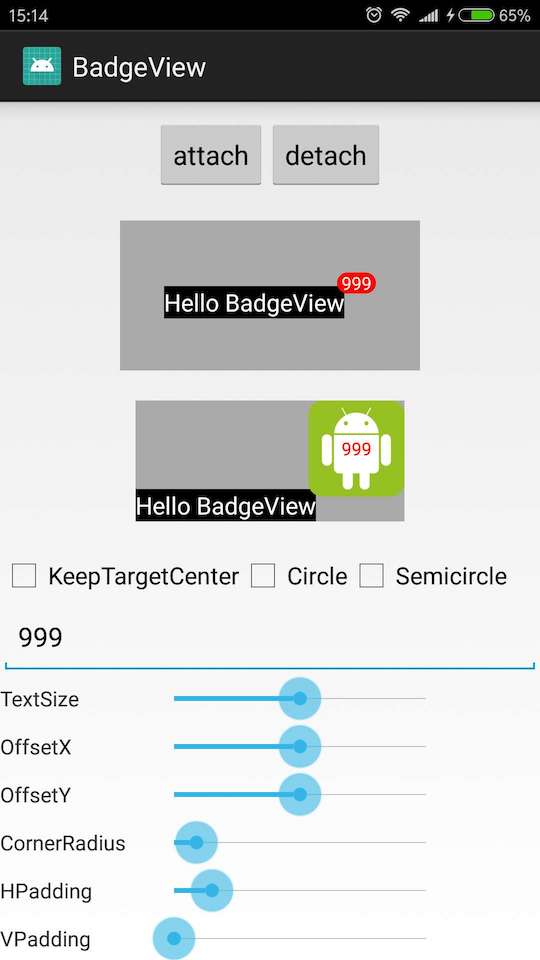
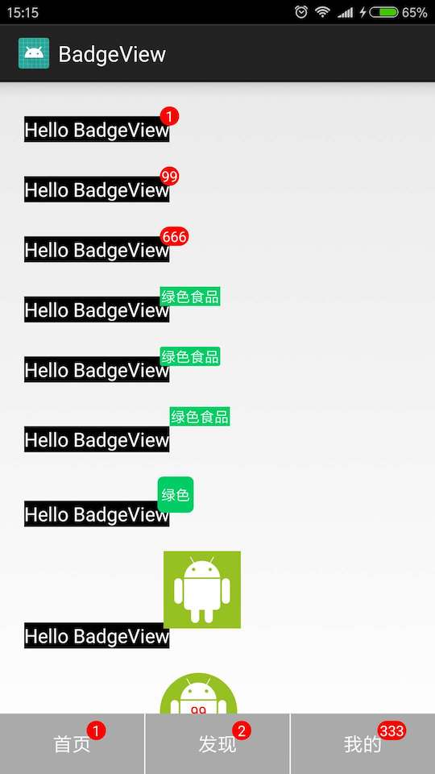

````
int padding = DensityUtils.dp2px(this, 1);
View tv = findViewById(R.id.tv);
BadgeView badgeView = new BadgeView(this);
badgeView.setPadding(padding, padding, padding, padding);
badgeView.setBackgroundColor(Color.parseColor("#00CC66"));
badgeView.setTextColor(Color.WHITE);
badgeView.setTextSize(DensityUtils.dp2px(this, 12));
badgeView.setText("绿色食品");
badgeView.setWidth(DensityUtils.dp2px(this, 30));
badgeView.setHeight(DensityUtils.dp2px(this, 30));
badgeView.setCircle(true); //BadgeView 背景默认是矩形
badgeView.setSemicircle(true); //矩形的圆角是否是半圆（radius = 高度/2）
badgeView.setCornerRadius(DensityUtils.dp2px(this, 2)); //矩形的圆角半径
badgeView.setOffset(0, 0); //offset 表示 BadgeView 与 TargetView 重叠的区域，(0, 0) 代表刚好没有重叠，缺省值 offsetX = offsetY = BadgeView 高度/2
badgeView.setKeepTargetCenter(true); // 让 TargetView 在 BadgeLayout 中居中
badgeView.attach(tv);
````

````
<com.fffz.badgeview.BadgeLayout
    android:layout_width="wrap_content"
    android:layout_height="wrap_content"
    android:layout_marginTop="20dp">

    <TextView
        android:layout_width="wrap_content"
        android:layout_height="wrap_content"
        android:background="@android:color/black"
        android:text="Hello BadgeView"
        android:textColor="@android:color/white"
        android:textSize="16dp" />

    <com.fffz.badgeview.BadgeView
        android:layout_width="wrap_content"
        android:layout_height="wrap_content"
        android:background="@drawable/android"
        BadgeView:circle="true"
        BadgeView:offsetX="8dp"
        BadgeView:offsetY="8dp"
        BadgeView:text="99"
        BadgeView:textColor="#ff0000" />
</com.fffz.badgeview.BadgeLayout>
````

优先级 setCircle > setSemicircle > setCornerRadius




